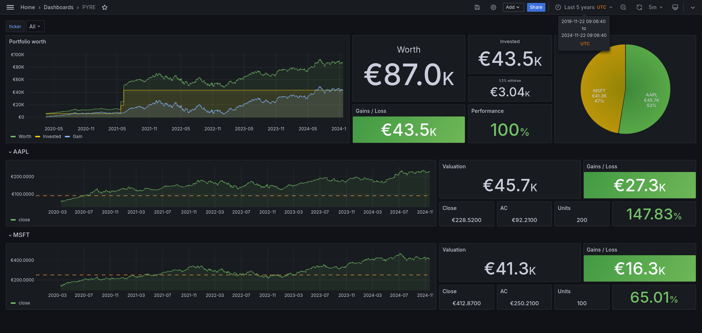

<p align="center">
    
</p>

Installation
============

```bash
poetry install
```

Portfolio monitoring
====================

Demo stack
----------

<p align="center">
    
</p>


To get a demo stack please run the `docker-compose` stack:

```bash
cd ./docker-compose/
docker compose up -d --build
```

This will build and run a showcase including: 

 - grafana and a pre-populated [PYRE dashboard](http://localhost:3000/d/pyre-dashboard/pyre?orgId=1&refresh=30s&from=now-5y&to=now)
 - postgresql database with the following [schemas](./src/pyre/db/schemas.py):
   - `orders`: table storing your market orders
   - `stock_data`: table storing your market values
 - crawler to periodically fetch latest market data
 - pyre rest API to interact with the database
 - init container to insert a bunch of order for demo purposes

To work with your data, you could either:

 - Copy demo [orders.yaml.example](./docker-compose/config/orders.yaml.example) with your own data (every field is mandatory) and rename it `orders.yaml`
 - create your own, remove the init container from the stack and run `PYRE_ENDPOINT=http://localhost:8000 pyre order bulk your/own/orders.yaml`


Configuration
-------------

### Crawler & API:

Both need to access postgre db:

 - `PYRE_DB_URL` (example: `my-postgresql:5432/my-db-name`): postgre host, port, db name combo
 - `PYRE_DB_USER` (example: `pyre-user`): postgre db user
 - `PYRE_DB_PASSWORD` (example: `pyre-secret`): postgre db password

### CLI:

 - `PYRE_ENDPOINT` (example: `http://my-api-host:8000`): protocol, host, port combo for `pyre` rest API. (Notice the protocol (`http(s)://`) is mandatory)

CLI
===

CLI is (or should be) self documented

```bash
poetry run pyre --help
```

Simulation
----------

[TODO] Simulation entrypoint needs to be documented

### Monthly DCA

```bash
# Simulate DCA investment strategy over 100 simulations
poetry run pyre simulate dca \
    --symbol '^990100-USD-STRD' \
    --amount 3000 \
    --seed 50000 \
    --start-date 2024-06-01 \
    --duration 17 \
    -n 100
```
