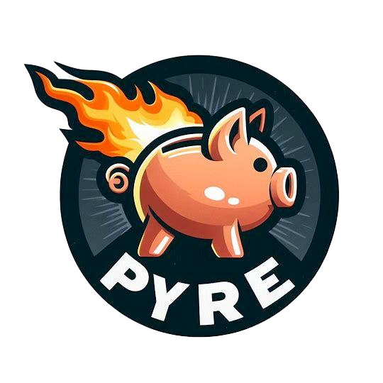

<p align="center">
    
</p>

Installation
============

```bash
poetry install
```


Usage
=====

```bash
poetry run pyre --help
```

Monthly DCA
-----------

```bash
# Simulate DCA investment strategy over 100 simulations
poetry run pyre simulate dca \
    --symbol URTH \ 
    --amount 3000 \
    --seed 50000 \
    --start-date 2024-06-01 \
    --duration 17 \
    -n 100  
```
